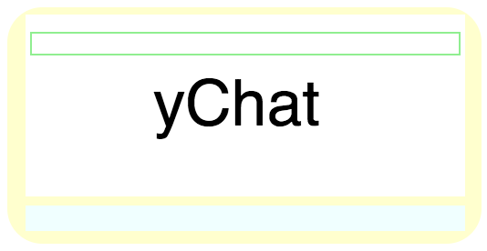

# ychat

***
a real-time chat app from [Dan McKeown](http://danmckeown.info) copyright 2017
***

***
Licensed under [ISC License](https://opensource.org/licenses/ISC)

## Table Of Contents
- [Features](#features)
- [QuickStart](#quickstart)
- [QuickStart with MongoDB](#quickstartMongo)
- [Requirements](#requirements)
- [Usage](#usage)
- [Installation](#installation)
- [Notes](#notes)

## features
[ychat](http://ychat.pacificio.com) provides the following features:

* Simplistic NodeJS account system using MongoDB with basic auth and [PassportJS](http://passportjs.org/)
* Front-end designed to look like a contemporary chat UI built with [ReactJS]
(https://facebook.github.io/react/) components
* [SocketIO](https://socket.io/)-powered real time chat service for multiple users

## quickstart
1. `cd ychat`
2. `npm install`
3. `npm run ychat`
4. visit the server at [http://localhost:3000](http://localhost:3000)

## quickstartMongo
1. `cd ychat`
2. `npm install`
3. `brew services start mongodb`
4. `npm run ychat-mongo`
5. visit the server at [http://localhost:3000](http://localhost:3000)

## requirements
- [NodeJS](https://nodejs.org/en/)
- NPM
- [MongoDB](https://www.mongodb.com/) [if you are using the ychat-mongo version]

## installation
- Check [NodeJS](https://nodejs.org/en/) version: `node --version` or install
- Check [NPM](https://www.npmjs.com/) version: `npm --version`
- If you are using the MongoDB version (`npm run ychat-mongo`) check that MongoDB [is installed](https://docs.mongodb.com/manual/tutorial/install-mongodb-on-os-x/): `brew upgrade mongodb`
- Clone the Git repo: `git clone <repo-url>`

## usage
- To start users should create an account at [/register](http://localhost:3000/register).
- Once an account is created, follow the link to the [home](http://localhost:3000) page and log in with the account.
- Once the chat page loads, the user can share chat messages with the room and receive messages from other users logged into the site
- ychat installations are one large chat room with all currently logged-in users able to send and receive messages to the whole ychat room.

## notes
- This project uses the [ExpressJS](https://expressjs.com/) server on NodeJS to serve the front-end files and answer API requests like login attempts and message passing over websockets
- Y Chat was bootstrapped with [Create React App](https://github.com/facebookincubator/create-react-app) and uses front-end based on code posted to [CodePen](https://codepen.io/pacificpelican/pen/WjwMjy)
- The default version [which runs from `npm run start`] saves user login data in the users.json file using [LokiJS](http://lokijs.org) while the ychat-mongo version [available at `npm run ychat-mongo`] persists the user data in a MongoDB document store
